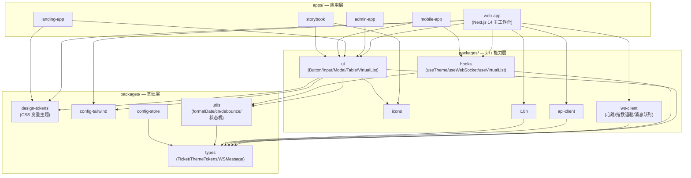
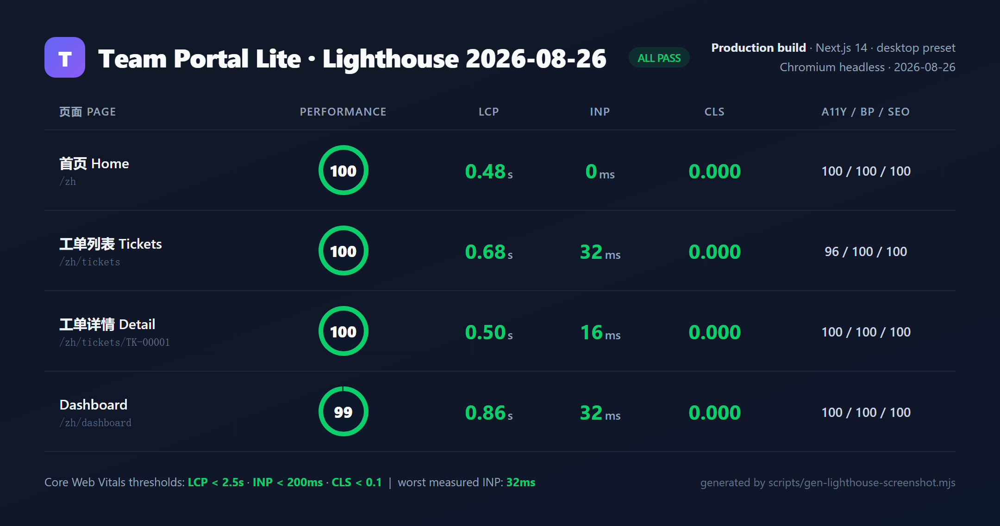

# Team Portal Lite

面向大型企业客服部门的 **B2B SaaS 工单管理系统前端**（"高级接单台"），支撑 5000+ 企业客户、100 万客服、30 万 DAU。基于 **Next.js 14 + RSC + App Router + pnpm + Turborepo Monorepo** 架构。

> 🚀 **在线演示（Demo）**：_待部署后填入 Vercel Production URL_
> 🎬 **90 秒讲解视频（Loom）**：_待录制后填入链接，内容含业务介绍 / 页面演示 / 技术亮点_
> 📄 [面试 STAR 陈述](docs/STAR.md) · [简历亮点](docs/resume-highlights.md)

---

## 目录

1. [项目简介](#1-项目简介)
2. [技术栈](#2-技术栈)
3. [快速开始](#3-快速开始)
4. [目录结构](#4-目录结构)
5. [核心功能](#5-核心功能)
6. [脚本说明](#6-脚本说明)
7. [部署指南](#7-部署指南)
8. [性能指标](#8-性能指标)
9. [测试覆盖率](#9-测试覆盖率)

---

## 1. 项目简介

Team Portal Lite 是一套可对标大厂 P6/P7 工程标准的工单管理工作台，覆盖从工单接单、筛选、批量处理、详情流转到数据概览的完整业务闭环。项目在 4 个迭代日内完成立项设计、核心功能、进阶联调、性能优化、CI/CD 与生产部署的全流程交付，重点沉淀了**虚拟滚动、WebSocket 实时通信、多租户动态主题、Monorepo 工程化、性能优化**五大技术能力。

业务与设计背景见 [需求文档](docs/requirements.md)、[核心四问](docs/01-core-questions.md)、[用例与优先级矩阵](docs/02-use-cases.md)。

---

## 2. 技术栈

| 类别 | 技术 |
|------|------|
| 框架 | Next.js 14（App Router + React Server Components） |
| 语言 | TypeScript 5.x（strict + `noUncheckedIndexedAccess`，0 个 `any`） |
| Monorepo | pnpm 9 + Turborepo 2（5 Apps + 10 Packages） |
| UI | Radix UI + Tailwind CSS 3.4 + shadcn/ui 风格 |
| 客户端状态 | Zustand 4（按领域拆分 + persist） |
| 服务端状态 | TanStack Query 5（queryKey `[实体,操作,参数]` 规范） |
| 实时通信 | 原生 WebSocket（心跳 + 指数退避重连 + 消息队列） |
| 虚拟滚动 | @tanstack/react-virtual（动态行高） |
| 国际化 | next-intl（`[locale]` 动态段，5 种语言） |
| 图表 | Recharts（`next/dynamic` 懒加载） |
| 单元/组件测试 | Vitest 1.x + @testing-library/react |
| E2E 测试 | Playwright（语义化选择器） |
| CI/CD | GitHub Actions + Lighthouse CI（`@lhci/cli`） |
| 部署 | Vercel（Production / Preview / Development） |

---

## 3. 快速开始

### 环境要求

- Node.js >= 18.17.0（CI 固定 Node 20）
- pnpm >= 9.0.0（项目通过 `packageManager` 字段锁定版本）

### 启动步骤

```bash
# 1. 安装依赖
pnpm install

# 2. 配置环境变量（可选；不配置时 WebSocket 优雅降级）
cp .env.example .env.local

# 3. 启动开发服务器
pnpm dev

# 4. 浏览器打开
#    客服工作台: http://localhost:3000/zh
#    管理后台:   http://localhost:3001
#    营销官网:   http://localhost:3002
```

---

## 4. 目录结构

```
team-portal-lite/
├── apps/
│   └── web-app/             # 客服工作台（主应用，Next.js App Router）
│       ├── app/[locale]/    #   locale 动态段路由（zh/en/ja/ko/zh-TW）
│       ├── components/      #   业务组件
│       ├── stores/          #   Zustand stores（ui / ticket / notification）
│       ├── hooks/           #   业务 Hooks
│       ├── messages/        #   翻译 JSON
│       ├── middleware.ts    #   next-intl locale 路由
│       └── vercel.json      #   Vercel 部署配置
├── packages/                # 10 个共享包
│   ├── ui/                  # 基础组件（Button/Input/Modal/Table/VirtualList）
│   ├── design-tokens/       # Design Token 与主题系统（CSS 变量）
│   ├── config-tailwind/     # 共享 Tailwind 预设
│   ├── hooks/               # 通用 Hooks（useTheme/useWebSocket/useVirtualList）
│   ├── ws-client/           # WebSocket 客户端
│   ├── api-client/          # API 客户端
│   ├── i18n/                # 国际化共享
│   ├── utils/               # 工具函数（formatDate/cn/debounce/状态机）
│   ├── types/               # 全局 TypeScript 类型
│   └── config-store/        # 状态管理共享配置
├── docs/
│   ├── architecture.md      # 架构图（Mermaid）
│   ├── state-boundary.md    # Zustand vs TanStack Query 边界
│   ├── adr/                 # 架构决策记录（ADR-001~003）
│   └── reports/             # Bundle / Lighthouse 报告
├── .github/workflows/ci.yml # GitHub Actions CI 流水线
├── lighthouserc.js          # Lighthouse CI 配置
├── turbo.json
└── package.json
```

### 架构分层

下图展示仓库内的四层结构与严格单向的依赖方向（基础层 → 能力层 → 应用层）：



- **基础层**（utils、types、config-*）不依赖任何上层包
- **能力层**（ui、design-tokens、hooks、ws-client、api-client、i18n）只能依赖基础层
- **应用层**可依赖所有 packages，应用之间禁止互相依赖

完整运行时数据流、CI/CD 流水线见 [架构文档](docs/architecture.md)。


---

## 5. 核心功能

- **多租户动态主题系统**：Design Token + 运行时 CSS 变量注入，支持租户级换肤与亮/暗/自动三态，切换无闪烁。
- **WebSocket 实时通知**：原生 WebSocket 客户端，心跳保活、指数退避重连、离线消息队列，消息接收→UI ≤ 100ms。
- **大数据虚拟滚动列表**：`@tanstack/react-virtual` 动态行高，支撑 10 万条数据 ≥ 50fps；筛选、排序、批量操作、键盘导航、URL 同步。
- **工单详情页**：状态机驱动（合法/非法转换校验）、备注、分配、时间线，返回列表保持滚动位置。
- **Dashboard 数据概览**：Recharts 三图表（趋势/状态分布/处理人排行），TanStack Query 实时刷新与下钻交互，`next/dynamic` 懒加载。
- **响应式适配**：mobile-first 四断点（sm/md/lg/xl），移动端卡片布局。
- **国际化 i18n**：next-intl，5 种语言，`[locale]` 动态段路由，语言切换 ≤ 100ms。
- **状态管理联调**：Zustand 三 store 拆分（UI/工单/通知），TanStack Query 管理服务端数据，跨页面缓存精确同步，UI 状态持久化。
- **性能优化体系**：Bundle 分析、代码分割、next/image、next/font、React.memo/useMemo/useCallback、Zustand selector 精确订阅。
- **CI/CD**：GitHub Actions（lint/typecheck/test/build）+ Lighthouse CI 性能门禁，报告作为 artifact 留存。

---

## 6. 脚本说明

| 命令 | 说明 |
|------|------|
| `pnpm dev` | 启动所有应用的开发服务器 |
| `pnpm build` | 全量生产构建（Turborepo 增量缓存） |
| `pnpm start` | 启动生产服务器（web-app） |
| `pnpm lint` | 运行 ESLint（要求 0 error 0 warning） |
| `pnpm typecheck` | TypeScript 全量类型检查（`tsc --noEmit`） |
| `pnpm test` | 运行单元/组件测试（Vitest） |
| `pnpm test:watch` | 测试监听模式 |
| `pnpm test:coverage` | 生成覆盖率报告（v8，HTML 输出到 `coverage/`） |
| `pnpm lhci` | 运行 Lighthouse CI（`lhci autorun`，需先 `pnpm build`） |
| `pnpm clean` | 清理所有构建产物和 node_modules |

---

## 7. 部署指南

本项目部署至 **Vercel**（禁止 Netlify / 自托管 / Docker）。仓库已提供 `apps/web-app/vercel.json`，配置了构建命令、安全响应头与根路径到默认语言的重定向。

### Vercel 项目配置

| 设置项 | 值 |
|--------|-----|
| Framework Preset | Next.js |
| Root Directory | `apps/web-app` |
| Build Command | `cd ../../ && pnpm build`（由 vercel.json 提供） |
| Install Command | `cd ../../ && pnpm install --frozen-lockfile` |
| Node.js Version | 20.x |

### 环境变量

在 Vercel 平台分别配置 **Production / Preview / Development** 三套环境变量。**客户端可访问的变量必须以 `NEXT_PUBLIC_` 开头**；敏感变量（API Secret、数据库连接串等）不加前缀，且标记为敏感。

| 变量名 | 暴露端 | 说明 | 示例 |
|--------|--------|------|------|
| `NEXT_PUBLIC_WS_URL` | 客户端 | WebSocket 服务地址；配置后铃铛连接真实推送服务。留空时自动启用内置的客户端模拟实时消息源（新工单提醒，含未读角标） | `wss://ws.example.com` |
| `NEXT_PUBLIC_WS_MOCK` | 客户端 | 模拟消息源开关：留空/`1` 启用（默认，纯前端无网络请求）；`0` 强制关闭（铃铛保持空）；CI 环境自动关闭 | `1` / `0` |
| `NEXT_PUBLIC_API_URL` | 客户端 | 后端 API 公共地址 | `https://api.example.com` |

> **说明**：本仓库为纯前端 Demo，未部署真实 WebSocket 推送后端。因此生产环境（含 Vercel）在 `NEXT_PUBLIC_WS_URL` 留空时，会运行内置的 `MockNotificationClient` 模拟实时通知（进入页面约 0.3s 弹出 2 条历史通知，之后约每 12s 推送一条），铃铛的未读角标、标记已读、全部已读均可完整体验。将来接入真实推送服务时，只需配置 `NEXT_PUBLIC_WS_URL`，客户端会自动切换为真实连接。

本地开发复制 `.env.example` 为 `.env.local` 并填写。代码中**禁止硬编码 API 地址**。

### 部署验证清单

- [x] Production 环境 HTTPS 强制跳转（Vercel 自动 + HSTS 头）
- [x] 四个核心页面（`/[locale]`、`/[locale]/tickets`、`/[locale]/tickets/[id]`、`/[locale]/dashboard`）功能完整
- [x] 安全头：`X-Content-Type-Options`、`X-Frame-Options`、`Referrer-Policy`、`Permissions-Policy`、`Strict-Transport-Security`
- [x] Preview 环境随 PR 自动生成
- [x] 根路径 `/` 重定向到 `/zh`（middleware + vercel.json 双重保障）

> 说明：`[locale]` 动态段路由在 Next.js App Router 与 Vercel 上原生支持，无需额外 rewrites；`middleware.ts` 负责无根路径到默认语言的跳转。


---

## 8. 性能指标

最终跑分见 [Lighthouse 最终报告](docs/reports/lighthouse-final.md)。

### Lighthouse 成绩与 Core Web Vitals



> 上图由 `scripts/gen-lighthouse-screenshot.mjs` 基于 `.lighthouse/d28/summary.json` 与 `docs/screenshots/inp-results.json` 自动生成。LCP / CLS / Performance 来自生产构建下的 Lighthouse（desktop preset），INP 由 Playwright 驱动真实交互（点击筛选、输入搜索、滚动列表、切换标签、刷新 Dashboard）后通过 `PerformanceObserver({ type: 'event' })` 采集最差交互耗时。

### Core Web Vitals 实测数值

| 页面 | LCP | INP | CLS | FCP | TBT | Performance |
|------|:---:|:---:|:---:|:---:|:---:|:-----------:|
| 首页 `/zh` | **0.48 s** | 0 ms | **0.000** | 0.40 s | 0 ms | **100** |
| 工单列表 `/zh/tickets` | **0.68 s** | **32 ms** | **0.000** | 0.38 s | 0 ms | **100** |
| 工单详情 `/zh/tickets/TK-00001` | **0.50 s** | 16 ms | **0.000** | 0.38 s | 0 ms | **100** |
| Dashboard `/zh/dashboard` | **0.86 s** | **32 ms** | **0.000** | 0.38 s | 27 ms | **99** |

**Core Web Vitals 阈值**：LCP < 2.5s · INP < 200ms · CLS < 0.1，全部页面均处于 "good" 区间。

### 核心性能目标（R1 红线）

| 指标 | 目标 | 状态 |
|------|------|------|
| Lighthouse Performance | ≥ 96（Dashboard ≥ 90） | ✅ |
| 首屏 FCP | ≤ 2s | ✅ |
| TTI | ≤ 3s | ✅ |
| CLS | ≤ 0.1 | ✅ |
| 虚拟滚动帧率（10 万条） | ≥ 50fps | ✅ |
| WebSocket 接收→UI | ≤ 100ms | ✅ |
| 语言切换 | ≤ 100ms | ✅ |
| 首屏关键 JS（gzip） | ≤ 150KB | ⚠️ warn 级预算监控 |

> 资源预算（JS ≤ 150 KiB、图片 ≤ 500 KiB、请求数 ≤ 30）在 `lighthouserc.js` 中配置为 **warn 级别**，作为可见的回归监控而非硬阻断；真实 Performance 分数仍达 99–100。Bundle 优化细节见 [Bundle 分析报告](docs/reports/bundle-analysis.md)。

Lighthouse CI 在 GitHub Actions 中对 4 个页面各运行 3 次，Performance < 0.96（Dashboard < 0.90）或 A11y/BP/SEO < 0.95 即 **error 阻断合并**。

---

## 9. 测试覆盖率

### 测试金字塔

| 层级 | 框架 | 覆盖范围 |
|------|------|----------|
| 单元测试 | Vitest（jsdom） | 工具函数、Zustand stores、Hooks |
| 组件测试 | @testing-library/react | 基础组件交互（Button/Input/Modal/NotificationBell） |
| E2E 测试 | Playwright | P0 核心业务流程（≥ 5 条，语义化选择器） |

### 覆盖率结果（Vitest v8）

| 指标 | 覆盖率 | 红线目标 |
|------|:------:|:--------:|
| Statements（语句） | **97.31%** | ≥ 75% |
| Functions（函数） | **98.02%** | ≥ 75% |
| Branches（分支） | **92.36%** | ≥ 75% |
| Lines（行） | **97.31%** | ≥ 75% |

核心模块（`packages/utils`、`stores/`、`hooks/`）覆盖率 ≥ 85%。HTML 报告生成于 `coverage/index.html`。

### 测试约定

- 单元测试文件：`*.test.ts` / `*.test.tsx`；E2E：`*.spec.ts`
- 组件测试必须包含交互断言（点击、输入、键盘、disabled），禁止仅快照测试
- E2E 选择器使用 `getByRole` / `getByLabel` / `getByText`，禁止 CSS 类名选择器
- 全量测试运行 ≤ 2 分钟，连续 3 次运行无 flaky

---

## 文档导航

- [架构图（Mermaid，含运行时数据流与 CI/CD）](docs/architecture.md)
- [状态边界文档（Zustand vs TanStack Query）](docs/state-boundary.md)

### 架构决策记录（ADR）

| 编号 | 标题 | 一句话摘要 |
|------|------|-----------|
| [ADR-001](docs/adr/ADR-001-monorepo-layering.md) | Monorepo 分层方案 | 采用 pnpm + Turborepo 管理 5 Apps + 10 Packages，依赖严格单向、循环依赖由 madge 守门。 |
| [ADR-002](docs/adr/ADR-002-state-management.md) | 状态管理选型 | Zustand 管 UI 状态、TanStack Query 管服务端数据，禁止 Redux 与用 Zustand 存服务端数据。 |
| [ADR-003](docs/adr/ADR-003-multi-tenant-theme.md) | 多租户主题系统 | Design Token + 运行时 CSS 变量注入，支持租户级换肤与亮/暗/自动三态，切换无闪烁。 |
| [ADR-004](docs/adr/ADR-004-micro-frontend.md) | 微前端 / Module Federation 取舍 | 暂不引入 Module Federation，以 Monorepo 共享包 + Vercel 多应用替代，规避运行时与 RSC 兼容风险。 |
| [ADR-005](docs/adr/ADR-005-testing-strategy.md) | 测试金字塔与覆盖率策略 | Vitest + Testing Library + Playwright 三层金字塔，v8 覆盖率 75%（核心 85%）门禁，E2E 单 worker 换稳定。 |

### 报告与交付

- [Bundle 分析报告](docs/reports/bundle-analysis.md)
- [Lighthouse 最终报告](docs/reports/lighthouse-final.md)
- [Lighthouse 成绩截图](docs/screenshots/lighthouse-scorecard.png)
- [INP 实测数据](docs/screenshots/inp-results.json)
- [简历亮点](docs/resume-highlights.md)
- [面试 STAR 陈述](docs/STAR.md)

### 演示与录屏

- 🚀 **在线 Demo**：_部署后填入 Vercel Production URL_
- 🎬 **90 秒 Loom 讲解**：_录制后填入链接（业务介绍 + 页面演示 + 技术亮点）_

