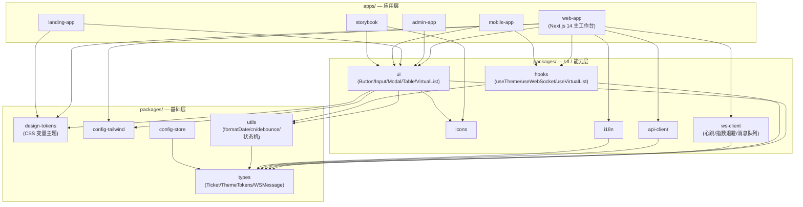
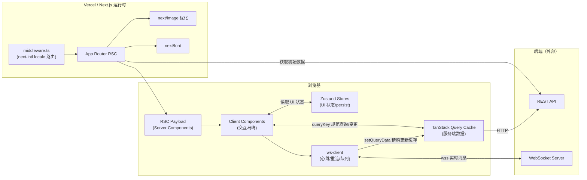
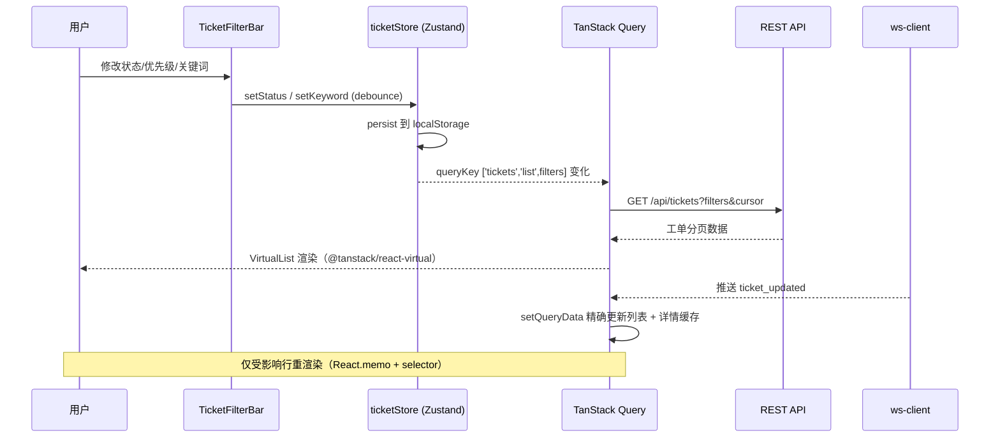
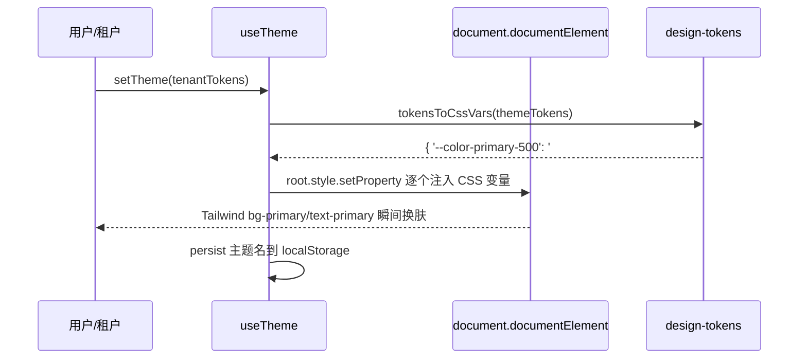
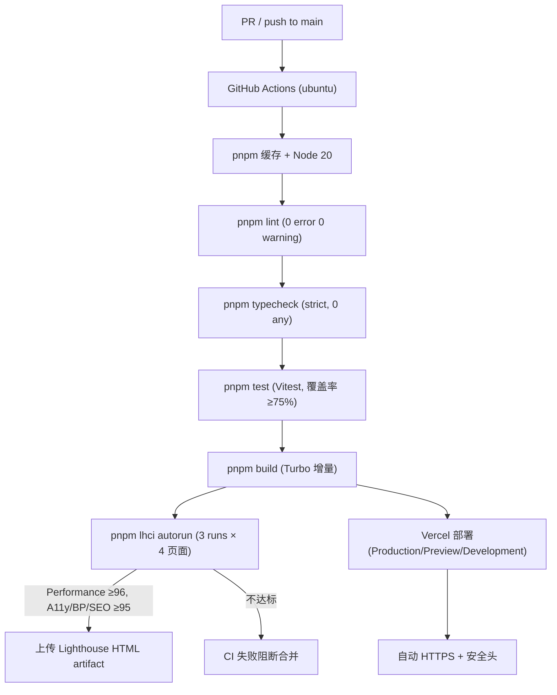

# 系统架构文档（Architecture）

> 本文档描述 Team Portal Lite 的 Monorepo 分层、运行时数据流与关键技术路径。
> 关联文档：[ADR-001](adr/ADR-001-monorepo-layering.md)（Monorepo 分层）、
> [ADR-002](adr/ADR-002-state-management.md)（状态边界）、
> [ADR-003](adr/ADR-003-multi-tenant-theme.md)（多租户主题）、
> [ADR-004](adr/ADR-004-micro-frontend.md)（微前端取舍）、
> [ADR-005](adr/ADR-005-testing-strategy.md)（测试策略）、
> [状态边界](state-boundary.md)。

---

## 1. Monorepo 分层架构

采用 **pnpm + Turborepo** 管理 5 个应用与 10 个共享包，依赖方向严格自上而下，禁止循环依赖（`pnpm madge` 守门）。

**分层规则**：

- **基础层**（utils、types、config-*）不依赖任何上层包
- **能力层**（ui、icons、hooks、ws-client、api-client、i18n）只能依赖基础层
- **应用层**可依赖所有 packages，应用之间禁止互相依赖

---

## 2. 运行时架构（web-app）

---

## 3. 核心数据流

### 3.1 工单列表（筛选 + 无限滚动 + 实时更新）

### 3.2 多租户主题切换

---

## 4. 构建与 CI/CD 流水线

---

## 5. 关键技术决策索引

| 关注点 | 方案 | ADR |
|--------|------|-----|
| 仓库结构 | pnpm + Turborepo，5 Apps + 10 Packages | ADR-001 |
| 状态管理 | Zustand（UI）+ TanStack Query（服务端），禁止 Redux | ADR-002 |
| 多租户主题 | Design Token + 运行时 CSS 变量注入 | ADR-003 |
| 微前端 | 暂不引入 Module Federation，Monorepo 共享包 + Vercel 多应用 | ADR-004 |
| 测试策略 | Vitest + Testing Library + Playwright 三层金字塔，v8 覆盖率门禁 | ADR-005 |
| 框架 | Next.js 14 App Router + RSC，`[locale]` 动态段 | — |
| 实时通信 | 原生 WebSocket（禁 socket.io），心跳 + 指数退避 | — |
| 大数据列表 | @tanstack/react-virtual 动态行高，目标 ≥50fps | — |
| 图表 | Recharts，`next/dynamic` 懒加载 + 骨架屏 | — |
| 性能门禁 | Lighthouse CI（@lhci/cli）作为 PR Check | — |
